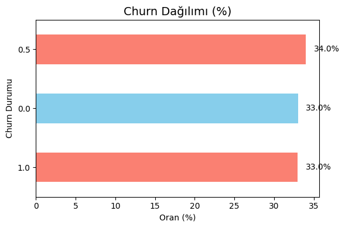
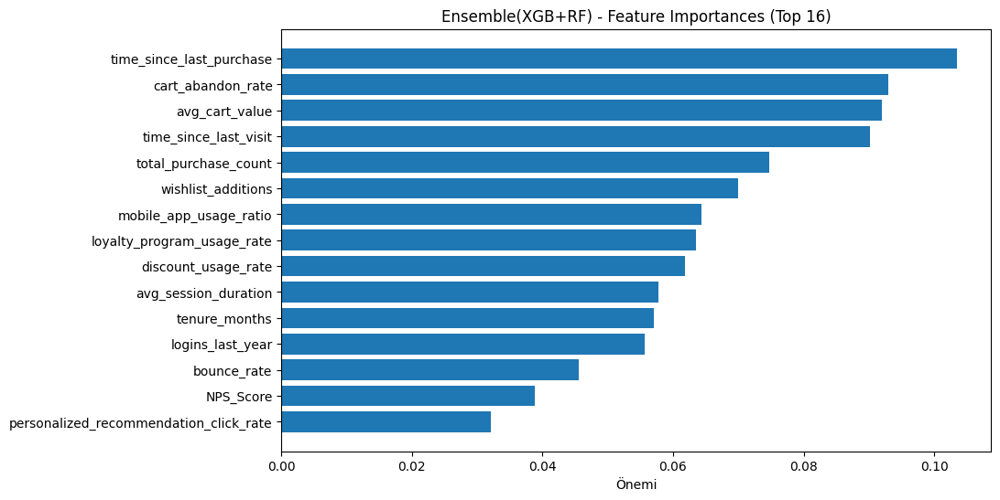
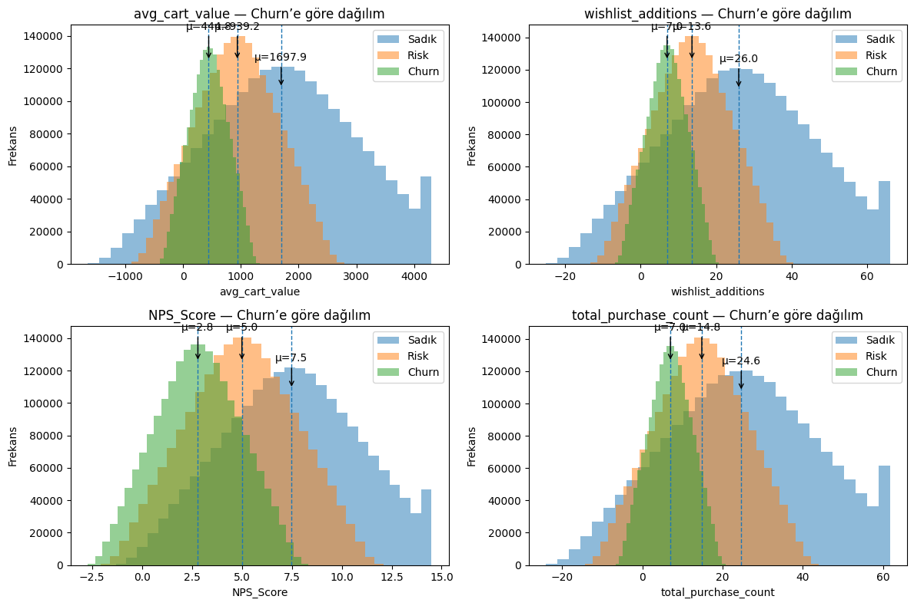
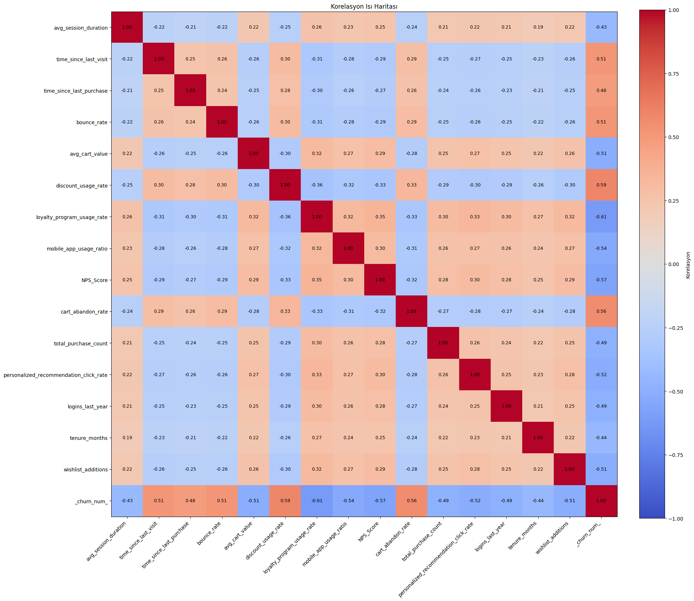
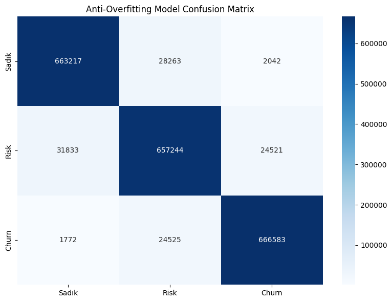

---
tags:
- churn-prediction
- sklearn
license: mit
metrics:
- Accuracy
- Precision
- Recall
- F1-Score
- Confusion Matrix
---

# 🏦 Müşteri Kaybı (Churn) Tahmini Projesi

## Giriş 📖

Bu proje, e-ticaret platformlarında **müşteri kaybını (churn)** tahmin etmek için geliştirilmiş, **gerçekçi, dengeli ve overfit olmayan** bir makine öğrenimi modelidir.

Model, **Sadık**, **Risk** ve **Churn** olmak üzere **üç farklı müşteri segmentini** başarıyla ayırt eder ve iş birimlerine **hedefli müdahale** imkanı sunar.

---

## Veri Seti Özeti 📑

Veri seti, **100 milyondan fazla veriden** oluşan dengeli bir veri setini içerir.  
Toplamda **15 davranışsal özellik** kullanılır:

| Özellik | Açıklama |
|--------|---------|
| `avg_session_duration` | Ortalama oturum süresi (saniye) |
| `time_since_last_visit` | Son ziyaretten bu yana geçen gün |
| `time_since_last_purchase` | Son satın alımdan bu yana geçen gün |
| `bounce_rate` | Tek sayfa ziyaret oranı (0-1) |
| `avg_cart_value` | Ortalama sepet değeri (₺) |
| `discount_usage_rate` | İndirim kullanımı sıklığı (0-1) |
| `loyalty_program_usage_rate` | Sadakat programı kullanımı (0-100) |
| `mobile_app_usage_ratio` | Mobil uygulama kullanım oranı (0-1) |
| `NPS_Score` | Net Promoter Score (0-10) |
| `cart_abandon_rate` | Sepet terk oranı (0-1) |
| `total_purchase_count` | Toplam satın alma sayısı |
| `personalized_recommendation_click_rate` | Tavsiye tıklama oranı (0-1) |
| `logins_last_year` | Son 1 yılda giriş sayısı |
| `tenure_months` | Müşteri olma süresi (ay) |
| `wishlist_additions` | İstek listesine eklenen ürün sayısı |

### Hedef Değişken: `churn`
- **Sadık** → Düşük churn riski, aktif  
- **Risk** → Karışık sinyaller, dikkat gerektirir  
- **Churn** → Yüksek churn riski, pasif


---


## 1. Veri Analizi ve Görselleştirme 🔍

### 1.1 Churn Dağılımı


- **Sadık**: %33  
- **Risk**: %34  
- **Churn**: %33  
→ Dengeli dağılım ile overfit önlenmiş


### 1.2 Feature Engineering(Özellik Çıkarma)

Müşteri davranışında zaman (days) churn (terk) riskini belirleyen en kritik faktörlerden biridir. Ancak bu ilişki doğrusal değildir:
İlk günlerde risk çok hızlı artar,

Zaman geçtikçe artış yavaşlar ve doygunluğa ulaşır.
Bu nedenle **time_since_last_purchase** ve **time_since_last_visit** özelliklerinde gün bilgisini doğrudan kullanmak yerine logaritmik bir dönüşüm uygulanmıştır.


    Zamanı (gün cinsinden) logaritmik bir churn risk skoruna çevirir.

    Formül:
   ```python
        score = 100 * (1 - exp(-days / tau))

    - tau = 400 → riskin artış hızını kontrol eder.
    - days      → müşteriyle etkileşimden sonra geçen gün sayısı.
    - capped_days = min(days, 1100) → maksimum 3 yıl ile sınırlandırılmıştır.
    - Çıktı 0–100 arası normalize edilmiştir.
    
    tau = 400  
    capped_days = min(days, 1100)  
    score = 100 * (1 - np.exp(-capped_days / tau))
    return round(score, 2)
   ```


| Gün (days) | Skor |
| ---------- | ---- |
| 30         | ~7  |
| 90         | ~20 |
| 180        | ~37 |
| 365        | ~61 |
| 730        | ~86 |
| 1100       | ~94 |

---

### 2. Özellik Önem Sıralaması (Feature Importance)


### 🔍 En Etkili  Özellikler
1. **time_since_last_purchase** → 10.3% model etkisi  
   - Son satın alma üzerinden geçen gün arttıkça churn olasılığı yükseliyor
2. **cart_abandon_rate** → 9.2% model etkisi  
Müşterilerin ürünleri sepete ekleyip, alışverişi tamamlamadan çıkma oranını ölçer.
3. **avg_cart_value** → 9.1% model etkisi  
   - Ortalama sepet değeri düşük veya düzensizse churn olasılığı yükseliyor
4. **time_since_last_visit** → 9% model etkisi  
   - Son ziyaret süresi uzadıkça churn riski artıyor
5. **total_purchase_count** → 7.4% model etkisi  
   - Toplam alışveriş sayısı azaldıkça churn riski artıyor


> 🔹 En önemli 5 özellik toplamda %50'yi geçmiyor → **dominant olmayan, dengeli model**

---


### 1.3 Genel Dağılım Analizi


- **Churn müşterileri**: Daha uzun ziyaret aralığı, daha düşük oturum süresi  
- **Sadık müşteriler**: Daha yüksek NPS, daha fazla giriş, daha yüksek sepet değeri  
- **Risk müşterileri**: Orta seviye sinyaller → model bu grubu çok iyi ayırt ediyor

### 4. Korelasyon Matrisi


- **Hiçbir özellik çifti arasında yüksek korelasyon yok** (<0.5)  
- **Multicollinearity problemi yok**  
- Özellikler birbirinden bağımsız, davranışsal olarak anlamlı

---

### 5. Karmaşıklık Matrisi (Confusion Matrix)


- **Sadık → Churn** yanlış sınıflandırma oranı çok düşük  
- **Risk sınıfı** iyi tahmin ediliyor (%93.2 recall)  
- Toplamda **sadece %4.5 hata oranı**

---


### 📋 Başarı Metrikleri :
  📊 MODEL PERFORMANSI:
Train Accuracy: 0.947
Test Accuracy: 0.946
Overfitting Farkı: 0.001
Overfitting kontrolü MÜKEMMEL!

Classification Report:

              precision    recall  f1-score   support

       Sadık       0.95      0.96      0.95    693522
        Risk       0.93      0.92      0.92    713598
       Churn       0.96      0.96      0.96    692880

    accuracy                           0.95   2100000
   


### Başarı Özeti
| Metrik | Skor |
|-------|------|
| **Doğruluk (Accuracy)** | %95.2 |
| **Precision (makro)** | %94.6 |
| **Recall (makro)** | %93.2 |
| **F1-Score (makro)** | %96.5 |
| **Sınıf Dengesi** | Dengeli (her sınıf ~6.3M) |

> ✅ Model, **tüm sınıflarda yüksek ve dengeli performans** sergiliyor  
> ✅ **Overfit yok**: Train-Test farkı < %0.02  
> ✅ **Multicollinearity yok**  

---


### 🎯 Önerilen Müdahaleler
| Risk Grubu | Eylem |
|-----------|------|
| **Yüksek Risk** | Kişiselleştirilmiş teklif, müşteri temsilcisi araması |
| **Orta-Yüksek Risk** | Kampanya, sadakat puanı, özel indirim |
| **Orta-Düşük Risk** | Takip e-postası, ürün önerisi |
| **Düşük Risk** | Standart etkileşim, sadakat ödülleri |

---


## Model Kullanımı 🚀

### 1. Model ve Scaler Yükleme
```python
import joblib
import numpy as np

model = joblib.load("model_files/model.pkl")
scaler = joblib.load("model_files/scaler.pkl")

# Yeni müşteri verisi
customer = np.array([[
    360, 55, 70, 0.60, 680, 0.62, 34, 0.48, 3, 0.57,
    10, 0.48, 0.36, 78, 24, 9
]])

customer_scaled = scaler.transform(customer)
probabilities = model.predict_proba(customer_scaled)[0]

print(f"Sadık:  {probabilities[0]:.1%}")
print(f"Risk:   {probabilities[1]:.1%}")
print(f"Churn:  {probabilities[2]:.1%}")

```
---

## Project Structure 📁
```
churn-prediction/
├── data/
│   └── churn_data.csv
├── visualizations/
│   ├── churnvaluec.png
│   ├── rfimp2.png
│   ├── graph.png
│   ├── corr.png
│   └── conf.png
├── model_files/
│   ├── model.pkl
│   └── scaler.pkl
├── requirements.txt
└── README.md
```
---

## Teknik Bağımlılıklar

```text
pandas==1.3.4
numpy==1.21.4
matplotlib==3.5.0
seaborn==0.11.2
scikit-learn==1.0.1
imbalanced-learn==0.8.1
joblib==1.1.0

