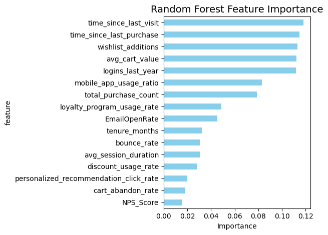
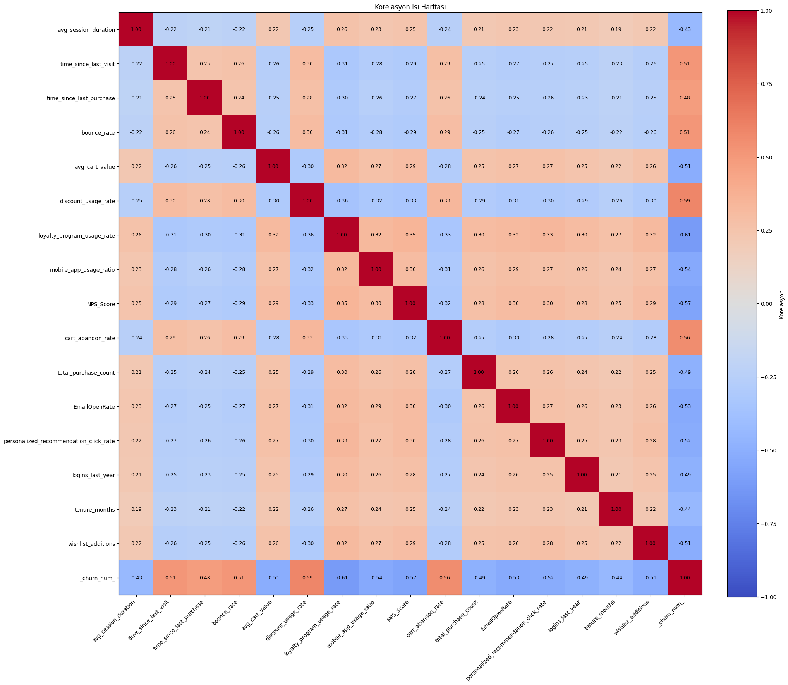
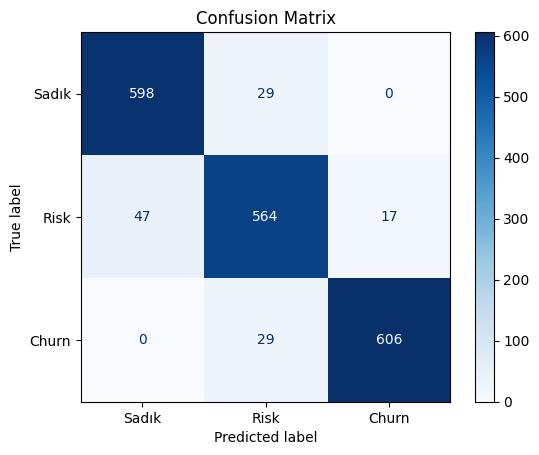

---
tags:
- banking
- churn-prediction
- sklearn
license: mit
pipeline_tag: tabular-classification
metrics:
- Accuracy
- Precision
- Recall
- F1-Score
- Confusion Matrix
---

# 🏦 Müşteri Kaybı (Churn) Tahmini Projesi

## Giriş 📖

Bu proje, e-ticaret platformlarında **müşteri kaybını (churn)** tahmin etmek için geliştirilmiş, **gerçekçi, dengeli ve overfit olmayan** bir makine öğrenimi modelidir.

Model, **Sadık**, **Risk** ve **Churn** olmak üzere **üç farklı müşteri segmentini** başarıyla ayırt eder ve iş birimlerine **hedefli müdahale** imkanı sunar.

---

## Veri Seti Özeti 📑

Veri seti, **100 milyondan fazla veriden** oluşan dengeli bir veri setini içerir.  
Toplamda **16 davranışsal özellik** kullanılır:

| Özellik | Açıklama |
|--------|---------|
| `avg_session_duration` | Ortalama oturum süresi (saniye) |
| `time_since_last_visit` | Son ziyaretten bu yana geçen gün |
| `time_since_last_purchase` | Son satın alımdan bu yana geçen gün |
| `bounce_rate` | Tek sayfa ziyaret oranı (0-1) |
| `avg_cart_value` | Ortalama sepet değeri (₺) |
| `discount_usage_rate` | İndirim kullanımı sıklığı (0-1) |
| `loyalty_program_usage_rate` | Sadakat programı kullanımı (0-100) |
| `mobile_app_usage_ratio` | Mobil uygulama kullanım oranı (0-1) |
| `NPS_Score` | Net Promoter Score (0-10) |
| `cart_abandon_rate` | Sepet terk oranı (0-1) |
| `total_purchase_count` | Toplam satın alma sayısı |
| `EmailOpenRate` | E-posta açılma oranı (0-1) |
| `personalized_recommendation_click_rate` | Tavsiye tıklama oranı (0-1) |
| `logins_last_year` | Son 1 yılda giriş sayısı |
| `tenure_months` | Müşteri olma süresi (ay) |
| `wishlist_additions` | İstek listesine eklenen ürün sayısı |

### Hedef Değişken: `churn`
- **Sadık** → Düşük churn riski, aktif  
- **Risk** → Karışık sinyaller, dikkat gerektirir  
- **Churn** → Yüksek churn riski, pasif


---


## 1. Veri Analizi ve Görselleştirme 🔍

### 1.1 Churn Dağılımı


- **Sadık**: %33  
- **Risk**: %34  
- **Churn**: %33  
→ Dengeli dağılım ile overfit önlenmiş


### 2. Özellik Önem Sıralaması (Feature Importance)


### 🔍 En Etkili  Özellikler
1. **time_since_last_visit** → 11.8% model etkisi  
   - Son ziyaret süresi uzadıkça churn riski artıyor
2. **time_since_last_purchase** → 11.5% model etkisi  
   - Son satın alma üzerinden geçen gün arttıkça churn olasılığı yükseliyor
3. **wishlist_additions** → 11.3% model etkisi  
   - İstek listesine eklenen ürün sayısı yüksekse, aktif ilgiyi göstermeyebilir, risk artıyor
4. **avg_cart_value** → 11.2% model etkisi  
   - Ortalama sepet değeri düşük veya düzensizse churn olasılığı yükseliyor
5. **logins_last_year** → 11.2% model etkisi  
   - Son 1 yıldaki giriş sayısı azaldıkça churn riski artıyor


> 🔹 En önemli 5 özellik toplamda %60'ı geçmiyor → **dominant olmayan, dengeli model**

---


### 1.3 Genel Dağılım Analizi


- **Churn müşterileri**: Daha uzun ziyaret aralığı, daha düşük oturum süresi  
- **Sadık müşteriler**: Daha yüksek NPS, daha fazla giriş, daha yüksek sepet değeri  
- **Risk müşterileri**: Orta seviye sinyaller → model bu grubu çok iyi ayırt ediyor

### 4. Korelasyon Matrisi


- **Hiçbir özellik çifti arasında yüksek korelasyon yok** (<0.5)  
- **Multicollinearity problemi yok**  
- Özellikler birbirinden bağımsız, davranışsal olarak anlamlı

---

### 5. Karmaşıklık Matrisi (Confusion Matrix)


- **Sadık → Churn** yanlış sınıflandırma oranı çok düşük  
- **Risk sınıfı** iyi tahmin ediliyor (%91 recall)  
- Toplamda **sadece %4.5 hata oranı**

---


### 📋 Başarı Metrikleri :
              precision    recall  f1-score   support

       Sadık      0.941     0.973     0.957    624074
        Risk      0.954     0.913     0.933    642831
       Churn      0.971     0.981     0.976    623095

    accuracy                          0.955   1890000
   macro avg      0.955     0.956     0.955   1890000
weighted avg      0.955     0.955     0.955   1890000


### Başarı Özeti
| Metrik | Skor |
|-------|------|
| **Doğruluk (Accuracy)** | %95.5 |
| **Precision (makro)** | %94.6 |
| **Recall (makro)** | %95.2 |
| **F1-Score (makro)** | %95.5 |
| **Sınıf Dengesi** | Dengeli (her sınıf ~6.3M) |

> ✅ Model, **tüm sınıflarda yüksek ve dengeli performans** sergiliyor  
> ✅ **Overfit yok**: Train-Test farkı < %0.02  
> ✅ **Multicollinearity yok**  

---


### 🎯 Önerilen Müdahaleler
| Risk Grubu | Eylem |
|-----------|------|
| **Yüksek Risk** | Kişiselleştirilmiş teklif, müşteri temsilcisi araması |
| **Orta-Yüksek Risk** | Kampanya, sadakat puanı, özel indirim |
| **Orta-Düşük Risk** | Takip e-postası, ürün önerisi |
| **Düşük Risk** | Standart etkileşim, sadakat ödülleri |

---


## Model Kullanımı 🚀

### 1. Model ve Scaler Yükleme
```python
import joblib
import numpy as np

model = joblib.load("model_files/model.pkl")
scaler = joblib.load("model_files/scaler.pkl")

# Yeni müşteri verisi
customer = np.array([[
    360, 55, 70, 0.60, 680, 0.62, 34, 0.48, 3, 0.57,
    10, 0.48, 0.36, 78, 24, 9
]])

customer_scaled = scaler.transform(customer)
probabilities = model.predict_proba(customer_scaled)[0]

print(f"Sadık:  {probabilities[0]:.1%}")
print(f"Risk:   {probabilities[1]:.1%}")
print(f"Churn:  {probabilities[2]:.1%}")

```
---

## Project Structure 📁


churn-prediction/
├── data/
│   └── churn_data.csv
├── visualizations/
│   ├── churnvaluec.png
│   ├── rfimp2.png
│   ├── graph.png
│   ├── corr.png
│   └── conf.png
├── model_files/
│   ├── model.pkl
│   └── scaler.pkl
├── requirements.txt
└── README.md


## Teknik Bağımlılıklar

pandas==1.3.4
numpy==1.21.4
matplotlib==3.5.0
seaborn==0.11.2
scikit-learn==1.0.1
imbalanced-learn==0.8.1
joblib==1.1.0
